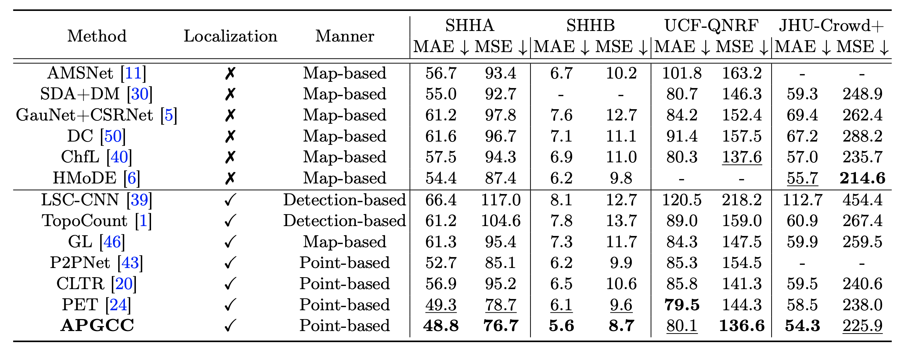

# APGCC: Improving Point-based Crowd Counting and Localization Based on Auxiliary Point Guidance (ECCV)

Official repository for APGCC: Improving Point-based Crowd Counting and Localization Based on Auxiliary Point Guidance.

[Project Page](https://apgcc.github.io/) | [Paper](https://arxiv.org/abs/2405.10589) | [Video](https://www.youtube.com/watch?v=b_ltwfD9dLI&embeds_referring_euri=https%3A%2F%2Fapgcc.github.io%2F&source_ve_path=Mjg2NjY) | [Code](https://github.com/AaronCIH/APGCC/tree/main/apgcc)

## Updates
- July 2024: ✨ Inference code has been released!
- July 2024: ✨ APGCC was accepted into ECCV 2024!

## Introduction
Crowd counting and localization have become increasingly important in computer vision due to their wide-ranging applications. While point-based strategies have been widely used in crowd counting methods, they face a significant challenge, i.e., the lack of an effective learning strategy to guide the matching process. This deficiency leads to instability in matching point proposals to target points, adversely affecting overall performance. To address this issue, we introduce an effective approach to stabilize the proposal-target matching in point-based methods.

We propose Auxiliary Point Guidance (APG) to provide clear and effective guidance for proposal selection and optimization, addressing the core issue of matching uncertainty. Additionally, we develop Implicit Feature Interpolation (IFI) to enable adaptive feature extraction in diverse crowd scenarios, further enhancing the model's robustness and accuracy. Extensive experiments demonstrate the effectiveness of our approach, showing significant improvements in crowd counting and localization performance, particularly under challenging conditions.


## Setup
1) Create a conda environment and activate it.
```
conda create --name apgcc python=3.8 -y
conda activatre apgcc
```
2) Clone and enter into repo directory.
```
git clone https://github.com/AaronCIH/APGCC.git
cd APGCC
```
3) Install remaining dependencies
```
pip install -r requirements.txt
```
4) Download pretrained APGCC checkpoints and place them into path (./apgcc/outputs/).
- [SHHA APGCC checkpoint](https://drive.google.com/file/d/1pEvn5RrvmDqVJUDZ4c9-rCJcl2I7bRhu/view?usp=sharing)
- You can also complete by the command:
```
cd apgcc
wget --no-check-certificate 'https://docs.google.com/uc?export=download&id=1pEvn5RrvmDqVJUDZ4c9-rCJcl2I7bRhu' -O ./output/SHHA_best.pth
```

## Prepare Dataset
We utilize a list file to collect all the imageas and the corresponding ground truth point annotations in a counting dataset. Please see this [page](https://github.com/gjy3035/Awesome-Crowd-Counting/blob/master/src/Datasets.md) to download the dataset, and then use the below command to create the data list.
```
cd apgcc
python pre_process_label.py $[src_path] $[dataset] $[output_path]
```
where \[src_path\] is the dataset path, \[dataset\] is the dataset name (e.g., 'SHHA', 'SHHB', 'NWPU'), and the \[output_path\] specify the output folder.
### Data Structures:
```
DATA_ROOT/
        |->train/
        |    |->scene01/
        |    |->scene02/
        |    |->...
        |->test/
        |    |->scene01/
        |    |->scene02/
        |    |->...
        |->train.list
        |->test.list
```
DATA_ROOT is the path containing the counting datasets.

### Annotations Format:
```
x1 y1
x2 y2
...
```

## Inference
- For SHHA dataset:
```
cd apgcc
bash test.sh 
```
In default, the results will be saved to "./output/", and you can customize the inference by the command.
```
python main.py -t -c $[config] TEST.WEIGHT $[checkpoint] OUTPUT_DIR $[output path] TEST.THRESHOLD $[threshold]
```
where \[config\] specifies the initial configuration and defaults as "./configs/SHHA_test.yml", \[checkpoint\] is your pretrained checkpoint, \[output path\] specifies the output folder, and \[threshold\] can filter different confidence levels. The more configure instruction please see the "./configs/SHHA_test.yml" files.

## Performance


## Visual Comparison
<table>
  <tr>
    <td>
      
    </td>
    <td>
      
    </td>
  </tr>
</table>

## Quantitative Comparison
### Evaluation on Crowd Counting

<table>
  <tr>
    <td>
        
    </td>
    <td>
        
    </td>
  </tr>
</table>

### Evaluation on Crowd Localization
<table>
  <tr>
    <td>
        
    </td>
    <td>
        
    </td>
  </tr>
</table>

## Reference
If you find this work useful, please consider citing us!
```python
@article{chen2024improving,
  title={Improving Point-based Crowd Counting and Localization Based on Auxiliary Point Guidance},
  author={Chen, I and Chen, Wei-Ting and Liu, Yu-Wei and Yang, Ming-Hsuan and Kuo, Sy-Yen},
  journal={arXiv preprint arXiv:2405.10589},
  year={2024}
}
```


